# 🚀 TaskFlow - Project & Task Management System

TaskFlow is a full-stack **Project and Task Management System** built with **FastAPI, React, and MySQL**.  
It is designed to help teams manage projects, assign tasks, track progress, and collaborate efficiently through a role-based workflow.

The application provides separate dashboards and permissions for **Admin, Manager, and Member** users.

---

# 📌 Features

## 🔐 Authentication & Security

- User Registration and Login
- JWT-based Authentication
- Password Hashing
- Protected Routes
- Role-Based Authorization

Supported Roles:

- 👑 Admin
- 👨‍💼 Manager
- 👨‍💻 Member

---

# 👑 Admin Features

- Admin Dashboard
- View System Statistics
- Manage Users
- Manage Projects
- Manage Tasks
- Assign Managers
- Manage Application Settings

---

# 👨‍💼 Manager Features

- Manager Dashboard
- Create Projects
- Update Project Details
- Assign Team Members
- Create Tasks
- Assign Tasks
- Update Task Status
- Track Project Progress
- Add Task Comments

---

# 👨‍💻 Member Features

- View Assigned Tasks
- Update Task Status
- View Project Information
- Add Comments
- Track Personal Work

---

# 📊 Application Features

- Project Management
- Task Management
- Task Assignment
- Comments System
- Search Functionality
- Filtering
- Pagination
- Role-Based Dashboard
- Responsive UI

---

# 🛠️ Tech Stack

## Frontend

| Technology | Usage |
|---|---|
| React | User Interface |
| Vite | Frontend Build Tool |
| React Router | Navigation |
| Axios | API Communication |
| CSS | Styling |

---

## Backend

| Technology | Usage |
|---|---|
| FastAPI | REST API Framework |
| SQLAlchemy | ORM |
| Pydantic | Data Validation |
| JWT | Authentication |
| Passlib | Password Hashing |

---

## Database

| Technology | Usage |
|---|---|
| MySQL | Database Management |

---

## 📂 Project Structure

```text
TaskFlow/
│
├── backend/                         # FastAPI Backend
│   │
│   ├── core/                        # Configuration, database connection, security
│   ├── models/                      # SQLAlchemy database models
│   ├── schemas/                     # Pydantic request and response schemas
│   ├── routers/                     # API endpoints and route handlers
│   ├── dependencies/                # Authentication and permission dependencies
│   │
│   ├── main.py                      # FastAPI application entry point
│   ├── requirements.txt             # Backend dependencies
│   └── .env                         # Environment variables (not committed)
│
│
├── frontend/                        # React Frontend
│   │
│   ├── src/
│   │   │
│   │   ├── admin/                   # Admin dashboard pages and components
│   │   ├── manager/                 # Manager dashboard pages and components
│   │   ├── member/                  # Member dashboard pages and components
│   │   ├── components/              # Reusable UI components
│   │   ├── layouts/                 # Application layouts
│   │   ├── services/                # Axios API services
│   │   ├── context/                 # React Context state management
│   │   ├── styles/                  # CSS files
│   │   │
│   │   ├── App.jsx                  # Main React component
│   │   └── main.jsx                 # React entry point
│   │
│   ├── public/                      # Static assets
│   ├── package.json                 # Frontend dependencies
│   └── vite.config.js               # Vite configuration
│
│
├── README.md                        # Project documentation
└── .gitignore                       # Git ignored files configuration

---

## 📸 Application Screenshots

### 🔐 Authentication

#### Login Page

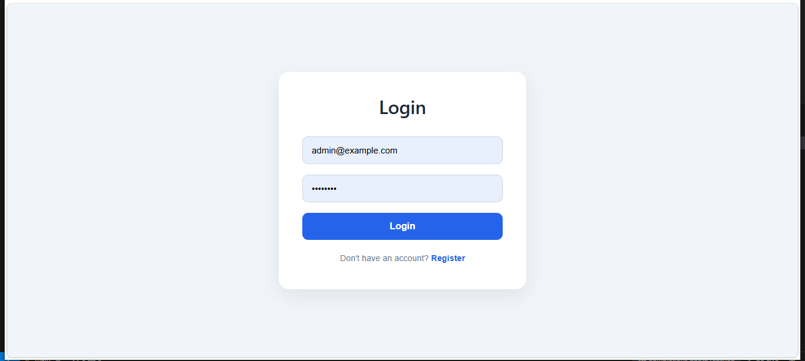

#### Register Page

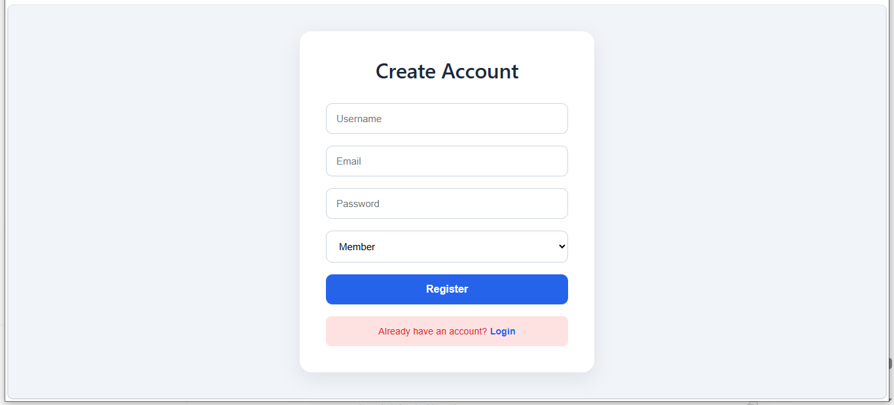


---

# 👑 Admin Dashboard

### Dashboard

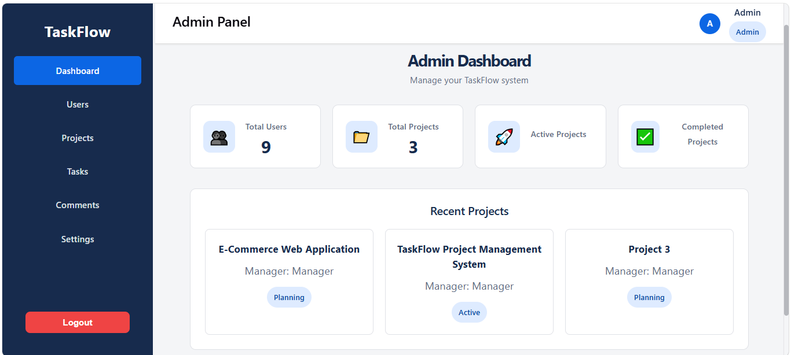

### Project Management

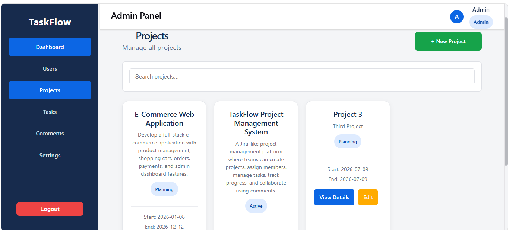

### Task Management

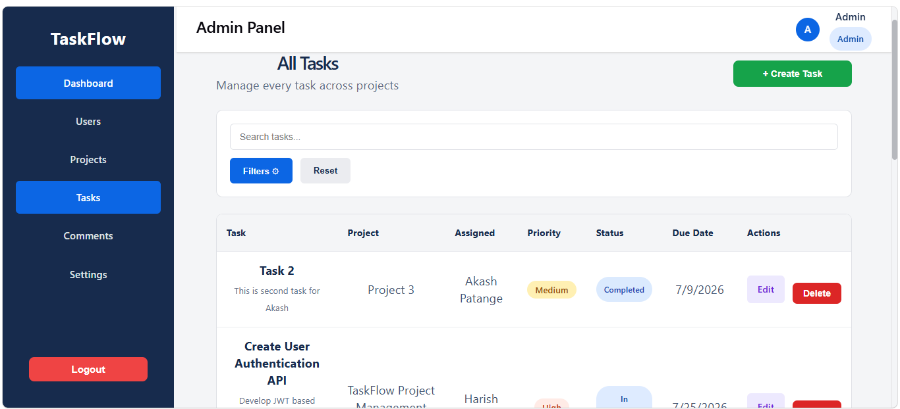

### User Management

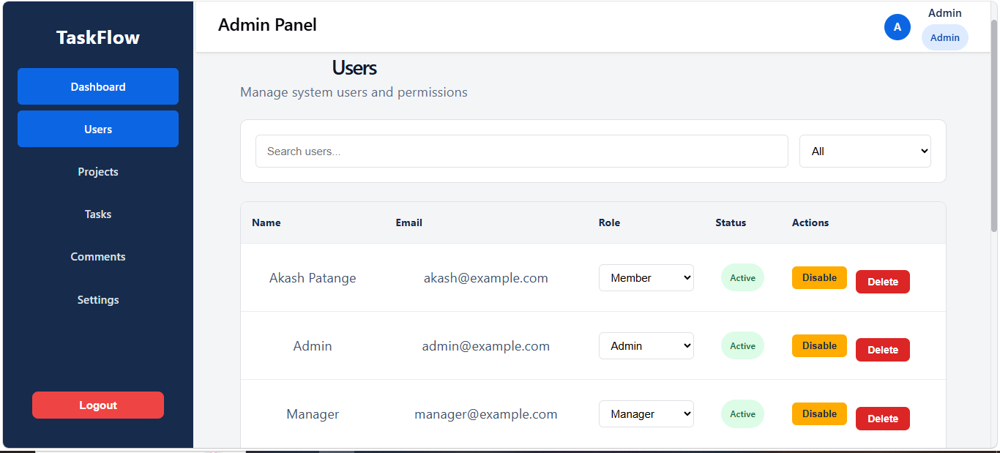

### Application Settings

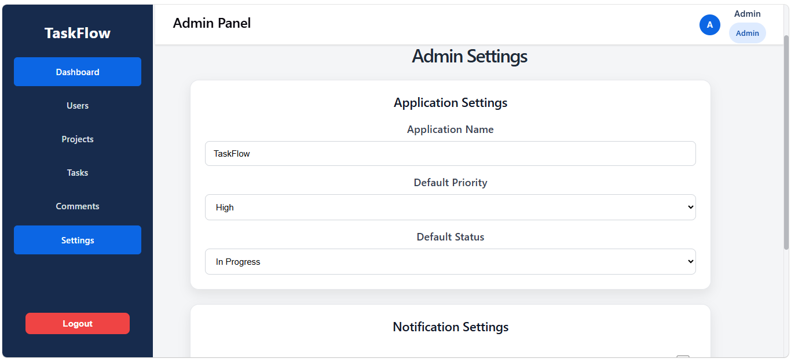

### Comments Management

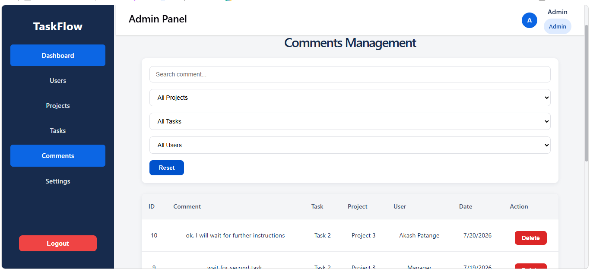


---

# 👨‍💼 Manager Dashboard

### Dashboard

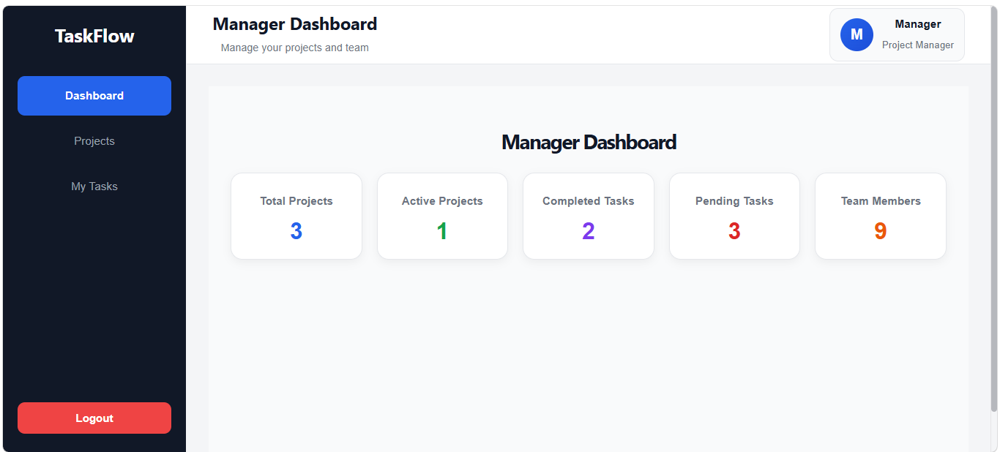

### Projects

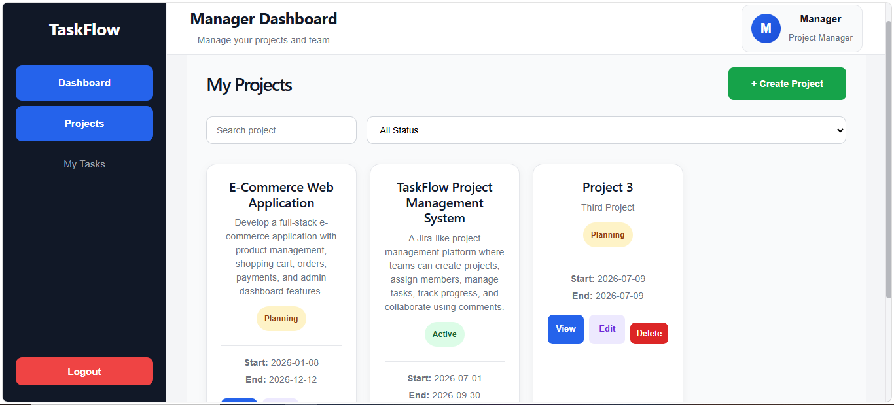

### Tasks

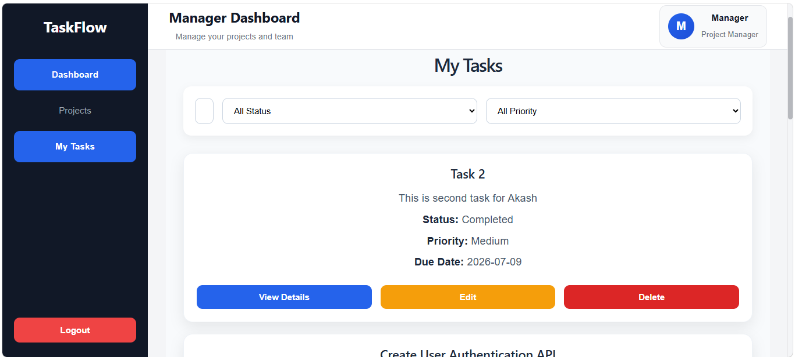


---

# 📋 Task Management

### Project Details

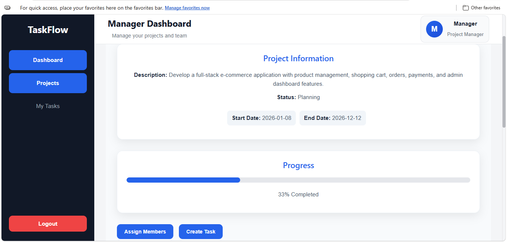

### Task Details

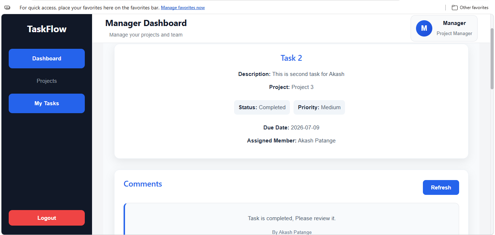


---

# 👨‍💻 User Dashboard

### Dashboard

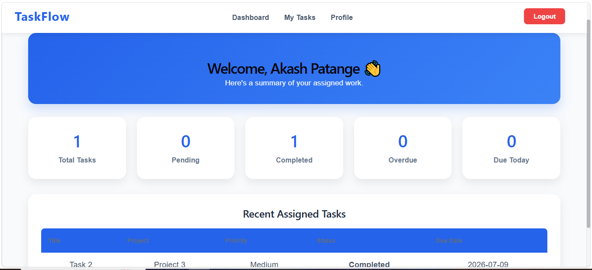

### Profile

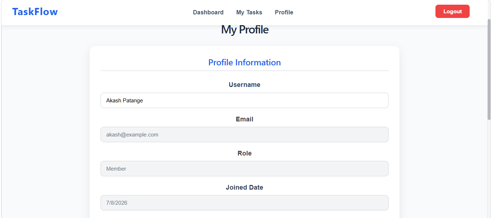

### Tasks

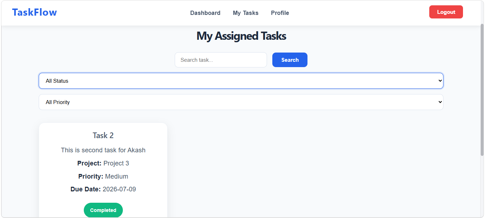

---
```
---
